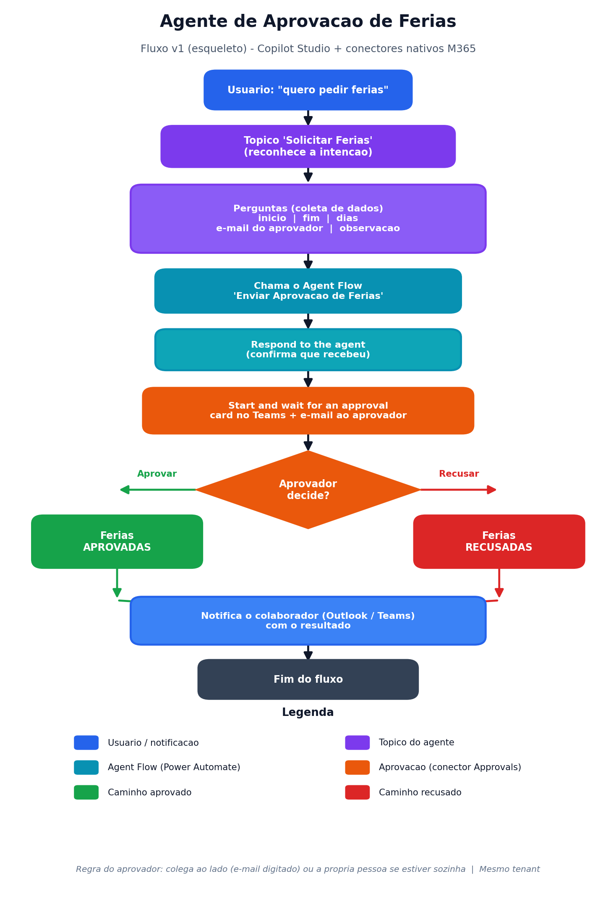
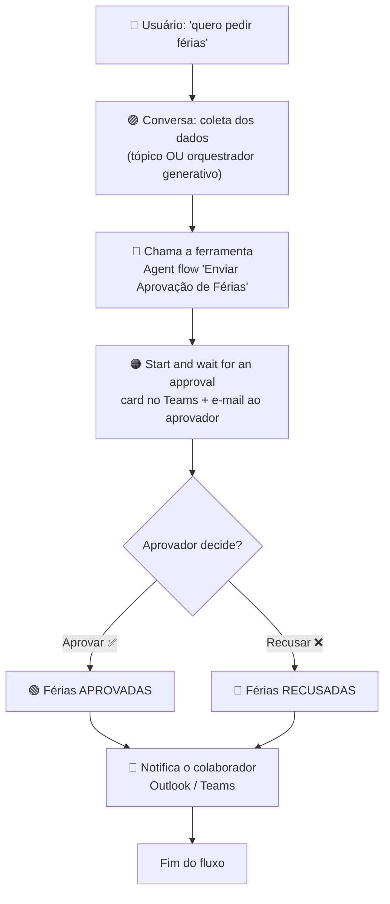

# 🏖️ Agente de Solicitação de Aprovação de Férias — Copilot Studio

<p align="Left">
  
</p>

> **Caso genérico** da trilha de exemplos práticos de **Microsoft Copilot Studio**.
> Mostra o "esqueleto" de um agente que **conversa, coleta dados e executa uma ação real** — sem código e usando só conectores nativos do Microsoft 365.
> O mesmo agente é construído em **3 modelos** para comparar a evolução da plataforma.

---

## 🎯 O que este agente faz

O colaborador conversa com o agente para **pedir férias**. O agente coleta os dados, dispara uma **aprovação** ao gestor/colega e devolve o resultado.

```
Usuário: "Quero pedir férias"
   ↓  coleta: início, fim, dias, aprovador, observação
   ↓  chama a ferramenta (agent flow)
   ↓  envia aprovação (card no Teams + e-mail)
   ↓  aprovador clica Aprovar ✅ / Recusar ❌
   ↓  agente confirma o resultado ao colaborador
```

---

## 🗺️ Fluxograma do processo



<details>
<summary>📐 Versão Mermaid (editável — o GitHub renderiza automaticamente)</summary>



</details>

---

## 🧩 Os 3 modelos (mesma ferramenta, conversas diferentes)

| Arquivo | Modelo | Como conduz a conversa | Quando usar | Complexidade |
|---|---|---|---|---|
| **MODELO-1-CLASSICO.md** | 🕰️ Antigo (clássico) | Tópico comanda tudo (frases + perguntas fixas) | Base histórica / quem vem do Studio antigo | ⭐⭐⭐☆☆ |
| **MODELO-2-COM-TOPICO.md** | 🧭 Novo, com tópico | Tópico conduz, com orquestração ligada | Precisa de **ordem fixa/validação** | ⭐⭐⭐☆☆ |
| **MODELO-3-SEM-TOPICO.md** | ⚡ Novo, sem tópico | **Orquestrador generativo** conduz sozinho | **Criação básica (recomendado)** | ⭐⭐☆☆☆ |

> 💡 A **ferramenta (agent flow)** que envia a aprovação é **idêntica** nos três. Muda só **quem conduz a conversa**.

### 🔍 Qual escolher?
- **Começando / laboratório rápido → Modelo 3 (sem tópico).** Menos peças; o orquestrador pergunta e responde sozinho.
- **Preciso controlar ordem/validação → Modelo 2 (com tópico).**
- **Quero mostrar de onde viemos → Modelo 1 (clássico).**

---

## 🧠 Orquestração generativa (o que mudou no Studio atual)

Os agentes novos já vêm com **orquestração generativa** ligada. Na prática, o agente:
- **escolhe a ferramenta pela descrição** dela;
- **gera sozinho as perguntas** para preencher os dados que faltam;
- **redige a resposta** automaticamente.

Por isso, no modelo novo, o **tópico virou opcional** — só é necessário quando se quer controle determinístico.

---

## 👥 Regra do aprovador (para a apresentação)

Para **incentivar a colaboração** durante o treinamento:
- **1ª opção:** o **colega ao lado** — a pessoa informa o e-mail do colega, que recebe o card no Teams.
- **2ª opção (fallback):** **a própria pessoa** — se estiver sozinha, aprova o próprio pedido só para ver o fluxo.

> ℹ️ O aprovador **precisa estar no mesmo tenant**. Aprovadores externos não funcionam.

---

## 🧰 Peças usadas (só nativo M365)

| Peça | Papel |
|---|---|
| **Agent flow** (a ferramenta) | Recebe os dados e executa a ação |
| **When an agent calls the flow** | Gatilho acionado pelo agente |
| **Start and wait for an approval** | Envia a aprovação (Teams + e-mail) |
| **Respond to the agent** | Devolve o resultado (em tempo real, Async OFF) |
| **Instruções / Tópico** | Conduzem a conversa (ver os 3 modelos) |

Nenhum sistema externo. Tudo dentro do Microsoft 365.

---

## ✅ Pré-requisitos
- Acesso ao **Microsoft Copilot Studio** e ao **Power Automate** no **mesmo ambiente**.
- Um colega no mesmo tenant para testar (ou usar o próprio e-mail).

---

## ▶️ Como usar esta trilha
1. Leia este **README**.
2. Escolha um modelo (**1**, **2** ou **3**) e siga o passo a passo do arquivo.
3. Use o **EVOLUCAO.md** para mostrar como o agente cresce (v1 → v2 → v3) — sem reconstruir.
